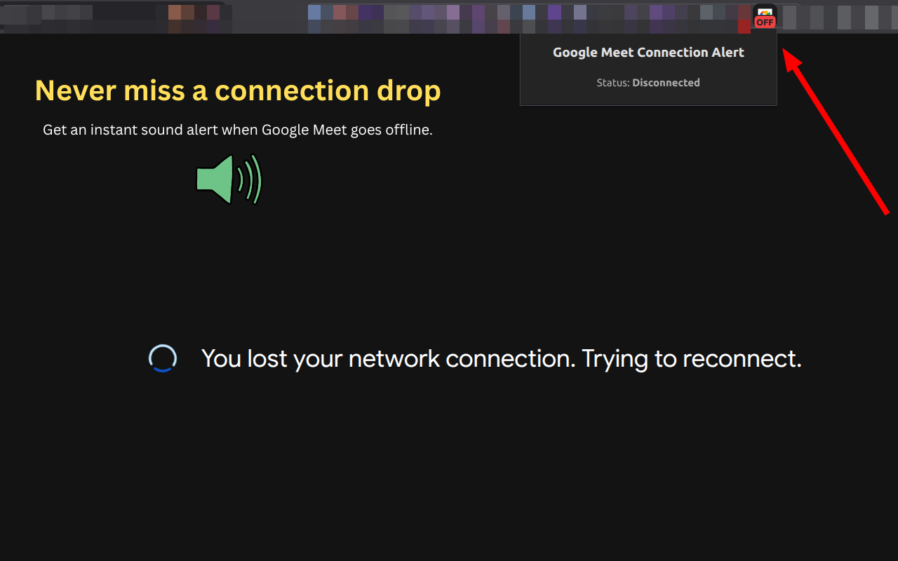

# Google Meet Connection Alert

A lightweight Chrome extension that monitors your Google Meet connection and alerts you when the connection is lost or restored.

## Features

- 🔴 **Connection lost alerts** — get a sound alert when Google Meet loses its network connection.
- 🟢 **Connection restored alerts** — hear a distinct sound when the connection comes back.
- 🔁 **Repeating alerts** — keep receiving alerts while the connection is down.
- 🟢 **Connection status badge** — see the current Meet connection status directly from the extension icon.
- 🌐 **Works in the background** — the Meet tab does not have to be active.
- 🔒 **Privacy-focused** — network activity is monitored locally and is not sent to external servers.

## How It Works

Google Meet Connection Alert monitors network requests made by Google Meet using the browser's `webRequest` API.

The extension uses a small finite state machine to determine whether the connection is:

- `connected`
- `disconnected`

A connection state is changed only after several consecutive successful or failed requests to reduce false positives.

The current state is stored using the browser's extension storage and can be consumed by the content script to trigger audio alerts.

## Why I Built It

I couldn't find a similar extension on the Chrome Web Store, and surprisingly, Google Meet doesn't provide a built-in connection alert.

When the connection is lost, Meet can fail silently for a while, and the UI may not clearly indicate the problem until later. I wanted an immediate, reliable way to know that the connection had dropped — even when the Meet tab is running in the background.
